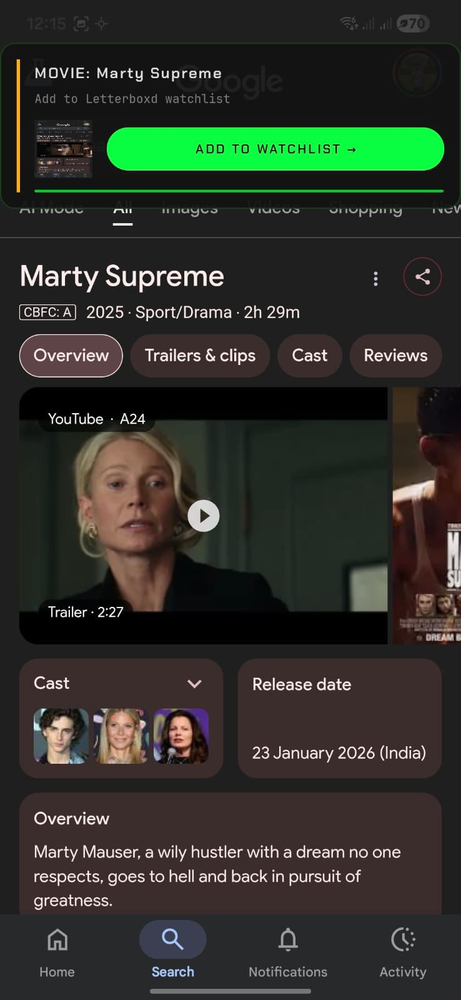

# ntent

**an AI agent that acts on your phone — from a screenshot or a sentence.**

you see something on your screen, you want something done about it. today that means: screenshot, switch apps, copy-paste, fill forms, tap through menus. ntent collapses all of that into one step.

screenshot it. or type it. the agent figures out your intent and executes it.

<p align="center">
  
</p>

##  agent that uses your phone like you do

what we have today is the foundation: intent detection + action execution from any input. where this goes:

- **bill tracker** — the agent opens whatsapp, scans your messages, finds every unpaid bill, calculates totals, tells you exactly who to pay and how much. perfect for shopkeepers managing daily khata.

- **smart shopping** — want to buy shoes? the agent checks amazon, flipkart, and every shopping app you have installed. compares prices, checks delivery dates for your address, tells you the best deal. no more switching between 5 apps.

- **SMB workflows** — small business owners running everything off their phone. inventory tracking, payment reminders, GST calculations — all through natural language.

the pattern is always the same: you express intent, the agent handles execution across apps.


## how it works

```
you ──→ screenshot or type anything ──→ AI understands intent ──→ agent acts
```

there's no "classify then show me options" step. you give it input, it does the thing. one tap to confirm, action executed across your apps in the background.

## what the agent can do

| you give it | the agent does |
|---|---|
| a restaurant bill | organizes it into folders automatically |
| an event poster | adds it to your calendar with date, time, venue |
| a tech article | forwards it to your friends on whatsapp |
| "Interstellar 2014" | adds it to your letterboxd watchlist |
| a coupon code | copies it to clipboard |
| wifi credentials | connects to the network |
| a business card | saves the contact |
| an address | opens it in maps |
| "meeting with John tomorrow 3pm" | sets a reminder |
| a boarding pass | adds the flight to your calendar |

screenshot and text are interchangeable inputs. the agent doesn't care how it gets the information — it cares about what to do with it.

## why this matters

claude computer use is arguably the greatest productivity boost we've seen this decade. but most Indians don't have access to a computer — almost every Indian does have a smartphone.

ntent brings agentic capability to the phone. not a chatbot. not an assistant you have to babysit. an agent that observes, understands, and acts.


## philosophy

if it takes more than one click, it's a bug.
